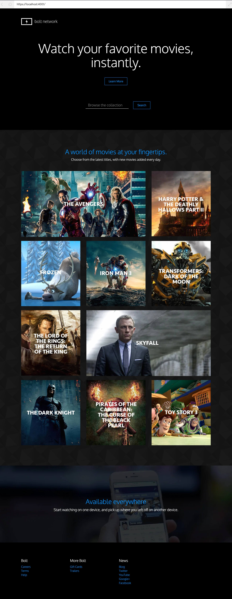

# Bolt Network

Proyecto simple para iniciantes en Ruby on Rails.

Pasos:

1. Crear un nuevo proyecto de rails llamado `bolt-network`.
```bash
$ rails new bolt-network
```
2. Moverse al nuevo directorio en instalar las gemas que se encuentran en el Gemfile.
```bash
$ bundle install
```
3. Generar un controlador llamado `Pages` con las acciones `home` y `about`. 
```bash
$ rails generate controller Pages
```
4. Agregue las plantillas para las vistas `app/views/pages/home.html.erb` y `app/views/pages/about.html.erb`.

5. Agregue sus estilos en `app/assets/stylesheets/pages.scss`.

6. Configure el layout `(app/views/layouts/application.html.erb)`.

```
💡 El archivo de diseño le permite crear una vista base que contiene todos los elementos comunes de su sitio, como los archivos CSS, el encabezado y el pie de página. 
```

7. Define la parte del diseño que las plantillas secundarias (como `home.html.erb` y `about.html.erb`) pueden completar con `<%= yield %&>`.

8. En el archivo de rutas `config/routes.rb`, configure la ruta para cada vista y una ruta por defecto.

9. Inicie su servidor Rails con `rails s -p PORT_NUMBER`.
```bash
$ rails s -p PORT_NUMBER
```

